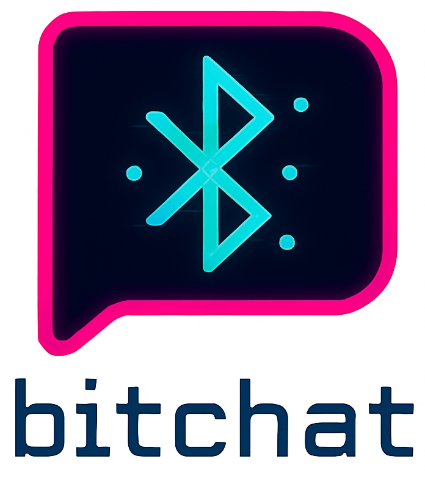

# Bitchat C++

<div align="center">
  
</div>

A cross-platform Bluetooth mesh chat application written in C++ with platform abstraction. Bitchat enables peer-to-peer messaging over Bluetooth Low Energy (BLE) without requiring internet connectivity or centralized servers.

[](https://github.com/bitchatz/bitchatz-cpp/actions/workflows/build.yml)

## How It Works

Bitchat creates a decentralized mesh network where devices communicate directly via Bluetooth Low Energy. Here's how the system operates:

### Core Architecture

1. **Mesh Networking**: Each device acts as both a sender and relay, forwarding messages to extend the network range
2. **BLE Transport**: Uses Bluetooth Low Energy for device discovery and data transmission
3. **Cryptographic Security**: Ed25519 signatures ensure message authenticity and prevent tampering
4. **Data Compression**: LZ4 compression reduces bandwidth usage and improves transmission speed
5. **Channel-based Communication**: Users can join different channels for organized conversations

### Protocol Flow

1. **Discovery**: Devices continuously scan for and advertise their presence
2. **Connection**: When devices are in range, they establish BLE connections
3. **Key Exchange**: Devices exchange cryptographic keys for secure communication
4. **Message Transmission**: Messages are encrypted, compressed, and sent as binary packets
5. **Relay**: Connected devices automatically relay messages to extend network coverage
6. **TTL Management**: Each packet has a Time-To-Live counter to prevent infinite loops

### Packet Types

- **ANNOUNCE**: Broadcast device presence and status
- **MESSAGE**: Chat messages with content and metadata
- **KEYEXCHANGE**: Cryptographic key exchange for secure communication
- **LEAVE**: Notify peers when disconnecting
- **CHANNEL_ANNOUNCE**: Join/leave channel notifications
- **FRAGMENT_***: Large message fragmentation support
- **DELIVERY_***: Message delivery confirmation system

## Project Structure

```
bitchat-cpp/
├── include/                   # Public headers
│   ├── bitchat/               # Core library headers
│   │   ├── core/              # Main application logic
│   │   │   └── bitchat_manager.h
│   │   ├── crypto/            # Cryptography and security
│   │   │   └── crypto_manager.h
│   │   ├── compression/       # Data compression (LZ4)
│   │   │   └── compression_manager.h
│   │   ├── protocol/          # Network protocol and packet handling
│   │   │   ├── packet.h
│   │   │   └── packet_serializer.h
│   │   └── platform/          # Platform abstraction layer
│   │       ├── bluetooth_interface.h
│   │       └── bluetooth_factory.h
│   └── platforms/             # Platform-specific headers
│       └── apple/             # macOS/iOS CoreBluetooth
│           └── bluetooth.h
├── src/                       # Implementation files
│   ├── bitchat/               # Core library implementation
│   │   ├── core/              # Core implementation
│   │   │   └── bitchat_manager.cpp
│   │   ├── crypto/            # Crypto implementation
│   │   │   └── crypto_manager.cpp
│   │   ├── compression/       # Compression implementation
│   │   │   └── compression_manager.cpp
│   │   ├── protocol/          # Protocol implementation
│   │   │   ├── packet_serializer.cpp
│   │   │   └── packet_utils.cpp
│   │   └── platform/          # Platform factory
│   └── platforms/             # Platform-specific implementations
│       └── apple/             # macOS/iOS CoreBluetooth
│           └── bluetooth.mm
├── cmake/                     # CMake utilities
│   └── CPM.cmake              # CPM dependency manager
├── main.cpp                   # Application entry point
├── CMakeLists.txt             # Build configuration
```

## Key Components

### Core Classes

- **BitchatManager**: Main orchestrator that manages the entire application lifecycle
- **BluetoothInterface**: Abstract interface for platform-specific Bluetooth implementations
- **CryptoManager**: Handles encryption, signatures, and key management using OpenSSL
- **CompressionManager**: LZ4 compression for efficient data transmission
- **PacketSerializer**: Binary serialization/deserialization of network packets

### Platform Abstraction

The Bluetooth functionality is abstracted through the `BluetoothInterface` class, allowing different implementations for each platform:

- **Apple**: Uses CoreBluetooth framework (implemented)
- **Windows**: Will use Windows Bluetooth APIs (TODO)
- **Linux**: Will use BlueZ (TODO)

## Building

### Prerequisites

- CMake 3.20 or higher
- C++20 compatible compiler
- OpenSSL development libraries
- Platform-specific Bluetooth libraries

### macOS

```bash
# Install dependencies
brew install cmake openssl

# Build
mkdir build && cd build
cmake ..
make

# Run
./bin/bitchat
```

### Linux

```bash
# Install dependencies
sudo apt-get install cmake libssl-dev libbluetooth-dev

# Build
mkdir build && cd build
cmake ..
make

# Run
./bin/bitchat
```

### Windows

```bash
# Install dependencies (using vcpkg or similar)
# TODO: Add Windows build instructions

# Build
mkdir build && cd build
cmake ..
cmake --build . --config Release

# Run
.\bin\Release\bitchat.exe
```

## Usage

The application provides a simple command-line interface for real-time messaging:

```
=== Bitchat Terminal Client ===
Connected! Type /help for commands.
Peer ID: 550e8400-e29b-41d4-a716-446655440000
Nickname: User_12345

> /help
Available commands:
/j #channel    - Join channel
/nick NICK     - Change nickname
/w             - Show people online in current channel
/clear         - Clear screen
/help          - Show this help
/exit          - Exit
Message        - Send message to current channel

> /j #general
Joined channel: #general

> /nick Alice
Nickname changed to: Alice

> Hello, world!
[14:30:15] You: Hello, world!
[14:30:16] Bob: Hi Alice!

> /w
People online:
- Alice (you) (channel: #general)
- Bob (channel: #general) (RSSI: -45 dBm)
- Charlie (channel: #random) (RSSI: -67 dBm)
```

### Commands

- **`/j #channel`**: Join a specific channel
- **`/nick NICKNAME`**: Change your nickname
- **`/w`**: Show online peers with signal strength and current channel
- **`/clear`**: Clear the terminal screen
- **`/help`**: Show available commands
- **`/exit`**: Exit the application

### Features

- **Real-time Messaging**: Instant message delivery to nearby devices
- **Channel Support**: Join different channels for organized conversations
- **Peer Discovery**: Automatically discover and connect to nearby devices
- **Signal Strength**: Display RSSI values to gauge connection quality
- **Message History**: View recent messages in the current session
- **Mesh Relay**: Messages are automatically relayed to extend network range

## Protocol Details

### Packet Structure

Each packet contains:
- **Version**: Protocol version (currently 1)
- **Type**: Packet type (ANNOUNCE, MESSAGE, etc.)
- **TTL**: Time-to-live for relay prevention
- **Timestamp**: Unix timestamp in milliseconds
- **Flags**: Compression, encryption, and routing flags
- **Sender ID**: Unique identifier of the sender
- **Recipient ID**: Target recipient (optional)
- **Payload**: Compressed and encrypted message data
- **Signature**: Ed25519 signature for authenticity

### Security

- **Ed25519 Signatures**: All messages are cryptographically signed
- **Key Exchange**: Devices establish secure communication channels
- **Message Integrity**: Prevents message tampering and replay attacks
- **Peer Authentication**: Verifies sender identity

### Compression

- **LZ4 Algorithm**: Fast compression for efficient data transmission
- **Automatic Compression**: Messages are automatically compressed when beneficial
- **Bandwidth Optimization**: Reduces Bluetooth transmission time

## Development

### Adding a New Platform

1. Create a new directory in `src/platforms/`
2. Implement the `BluetoothInterface` abstract class
3. Add platform-specific headers in `include/platforms/`
4. Update `CMakeLists.txt` with platform-specific settings and libraries

### Code Style

- Use C++20 features
- Follow RAII principles
- Use smart pointers for memory management
- Thread-safe design with proper mutex usage
- Comprehensive error handling
- Platform abstraction for cross-platform compatibility

### Dependencies

- **spdlog**: Fast logging library
- **OpenSSL**: Cryptography and security
- **LZ4**: Data compression
- **uuid-v4**: UUID generation
- **Platform Bluetooth APIs**: CoreBluetooth (Apple), Windows Bluetooth, BlueZ (Linux)

## Troubleshooting

### Common Issues

1. **Bluetooth not working**: Ensure Bluetooth is enabled and the app has permissions
2. **No peers visible**: Check that other devices are running Bitchat and in range
3. **Build errors**: Verify all dependencies are installed and CMake version is 3.20+

### Debug Information

The application logs detailed information including:
- Connection events
- Packet transmission/reception
- Peer discovery
- Error conditions

## Contributing

1. Fork the repository
2. Create a feature branch
3. Make your changes following the code style guidelines
4. Add tests if applicable
5. Submit a pull request

## TODO

- [x] macOS Bluetooth implementation
- [ ] Windows Bluetooth implementation
- [ ] Linux Bluetooth implementation
- [ ] Unit tests and integration tests
- [x] CI/CD pipeline
- [ ] Performance optimizations
- [x] Message encryption (end-to-end)
- [ ] File sharing support
- [ ] Group chat features
- [ ] Offline message storage

## Original Projects

This C++ implementation is based on the original Bitchat projects:

- [Bitchat Android](https://github.com/permissionlesstech/bitchat-android) - Android implementation
- [Bitchat iOS](https://github.com/permissionlesstech/bitchat) - Original project

## License

MIT
