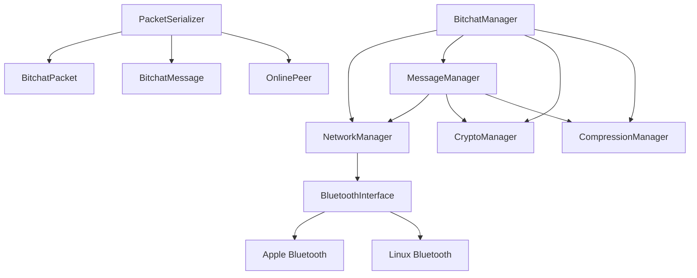

# Bitchat C++ Architecture

## Overview

Bitchat C++ follows a modular architecture designed for maintainability, testability, and extensibility. The system is organized into distinct layers with clear separation of concerns.

## Architecture Layers

### 1. Core Layer (`include/bitchat/core/`)

The core layer contains the main orchestrators and business logic:

#### BitchatManager
- **Purpose**: Main orchestrator that coordinates all components
- **Responsibilities**:
  - Initialize and manage all subsystems
  - Provide high-level API for the application
  - Handle lifecycle management (start/stop)
  - Coordinate callbacks between components
- **Dependencies**: All other managers

#### NetworkManager
- **Purpose**: Manages network operations and peer discovery
- **Responsibilities**:
  - Bluetooth interface management
  - Peer discovery and tracking
  - Packet routing and relay
  - Network state management
- **Dependencies**: BluetoothInterface, Protocol layer

#### MessageManager
- **Purpose**: Handles chat messages and conversation state
- **Responsibilities**:
  - Message creation and processing
  - Channel management
  - Message history
  - Private messaging
- **Dependencies**: NetworkManager, CryptoManager, CompressionManager

### 2. Platform Layer (`include/bitchat/platform/`)

Platform-specific implementations and abstractions:

#### BluetoothInterface
- **Purpose**: Abstract interface for Bluetooth operations
- **Responsibilities**:
  - Device discovery
  - Connection management
  - Data transmission
  - Platform abstraction

#### BluetoothFactory
- **Purpose**: Factory for creating platform-specific Bluetooth implementations
- **Responsibilities**:
  - Platform detection
  - Interface instantiation

### 3. Protocol Layer (`include/bitchat/protocol/`)

Protocol definitions and serialization:

#### Packet Classes
- **BitchatPacket**: Core packet structure
- **BitchatMessage**: Chat message structure
- **OnlinePeer**: Peer information structure

#### PacketSerializer
- **Purpose**: Serialize/deserialize protocol data
- **Responsibilities**:
  - Message payload creation/parsing
  - Packet construction
  - Protocol compliance

#### ProtocolUtils
- **Purpose**: Protocol utility functions
- **Responsibilities**:
  - UUID generation
  - Timestamp handling
  - Data conversion utilities

### 4. Crypto Layer (`include/bitchat/crypto/`)

Cryptographic operations:

#### CryptoManager
- **Purpose**: Cryptographic operations and key management
- **Responsibilities**:
  - Key pair generation/loading
  - Digital signatures
  - Signature verification
  - Key exchange

### 5. Compression Layer (`include/bitchat/compression/`)

Data compression:

#### CompressionManager
- **Purpose**: Data compression and decompression
- **Responsibilities**:
  - LZ4 compression/decompression
  - Compression decision logic
  - Performance optimization

## Component Relationships

## Data Flow

### Message Sending
1. **BitchatManager** receives send request
2. **MessageManager** creates message and packet
3. **CryptoManager** signs the packet
4. **CompressionManager** compresses if beneficial
5. **NetworkManager** sends via Bluetooth
6. **BluetoothInterface** transmits to peers

### Message Receiving
1. **BluetoothInterface** receives packet
2. **NetworkManager** processes and routes packet
3. **MessageManager** parses and validates message
4. **CryptoManager** verifies signature
5. **CompressionManager** decompresses if needed
6. **BitchatManager** notifies UI via callback

## Threading Model

### NetworkManager Threads
- **Main Thread**: API calls and state management
- **Announce Thread**: Periodic peer announcements
- **Cleanup Thread**: Stale peer removal

### MessageManager Threads
- **Main Thread**: Message processing and history management
- **Background**: Async operations (if needed)

### BluetoothInterface Threads
- **Platform-specific**: Bluetooth event handling
- **Main Thread**: API calls and state management

## Error Handling

### Exception Safety
- All public methods are exception-safe
- RAII for resource management
- Graceful degradation on errors

### Error Propagation
- Return codes for recoverable errors
- Exceptions for unrecoverable errors
- Logging at appropriate levels

## Configuration

### Build-time Configuration
- Platform detection (Apple/Linux/Windows)
- Feature flags
- Compiler-specific optimizations

### Runtime Configuration
- Bluetooth settings
- Crypto parameters
- Compression thresholds

## Testing Strategy

### Unit Testing
- Each manager can be tested independently
- Mock interfaces for dependencies
- Protocol compliance testing

### Integration Testing
- End-to-end message flow
- Cross-platform compatibility
- Performance benchmarks

## Future Extensions

### Planned Features
- Message encryption
- File sharing
- Voice messages
- Group channels

### Architecture Benefits
- Easy to add new features
- Platform independence
- Testable components
- Clear separation of concerns

## Performance Considerations

### Memory Management
- RAII for automatic cleanup
- Smart pointers for ownership
- Efficient data structures

### Network Optimization
- Compression for large messages
- Connection pooling
- Bandwidth monitoring

### Thread Safety
- Lock-free operations where possible
- Minimal critical sections
- Async operations for I/O
